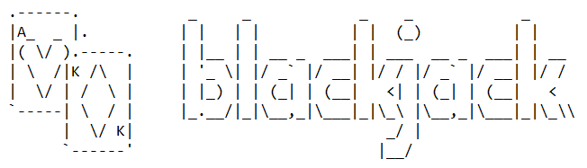

# Building a Blackjack environment in Turtle
<p align="center">
   
</p>
<br>
I have been trying to build custom environments for RL learning which gives an agent better observations/ states that are not just a bunch of pixels. With this objective, I have created this Blackjack environment
<br><br><br><br>
<b><i>P.S.:This is just a readymade game to play manually. I intend to update this as a proper Gym environment soon</b></i>

### How to play
Run 
```
python main.py
```
